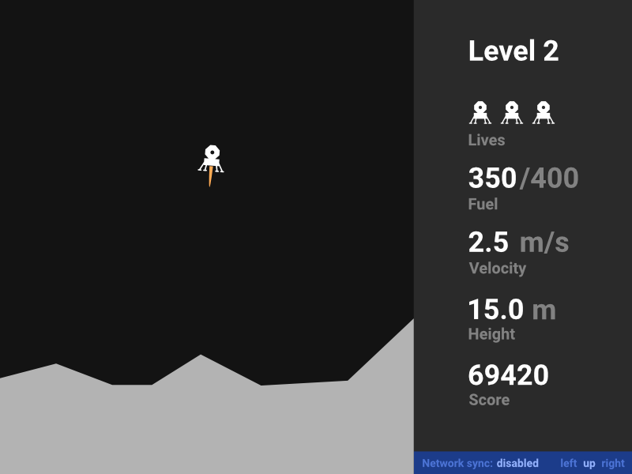

# Lunar Lander



## How to get it going

The game should run perfectly with any Java version 11 or higher. It may also
run on lower versions, although we did not test it.

The Gradle build system takes care of every dependency in the project, so to
run the game, you can simply:

```bash
./gradlew run
```

or in Windows:

```batch
gradlew.bat run
```

It will automatically build and run the game. You can also just build it with
`./gradlew build`.

And to run the server, just:

```
./gradlew runserver
```

in Windows:

```
gradlew.bat runserver
```


## Description

A simple 2D game written in Java 11 and JavaFX 11 in which you
have to touch down on the Moon with low enough velocity and
angle to the ground until you run out of fuel.

A GUI mockup is shown in `docs/gui_mockup` directory.


## Steering

Left/Right Arrows - control the rotation of the lander
Up Arrow - control the thrust of the lander's engine


## Javadoc

We prepared a quite extensive documentation in Javadoc. To build it with
Gradle, run:

```bash
./gradlew javadoc
```

or `gradle.bat javadoc` in Windows.


## Gradle integration

If more JavaFX modules are needed, add them to `build.gradle` file:

```groovy
javafx {
    version = '11.0.2'
    modules = [
        'javafx.controls',
        'javafx.add_module_here'
    ]
}
```


## IntelliJ IDEA integration

To connect Gradle Build System to IntelliJ, you have to add a module. To do this:

Go to `File > New > Module from Existing Sources...` and select `[project_folder]/build.gradle`.

You also don't have to use the terminal to execute Gradle tasks. You can open Gradle pane (on the right)
and go to `lunarlander > Tasks > [task_folder] > [task]`, for example `[application] > [run]`.


## First stage

Project design brief and first stage details are specified in
[design_brief](docs/design_brief.md) Markdown file.


## Second stage

Project changelog and class diagram is specified in
[second_stage](docs/second_stage.md) Markdown file.

