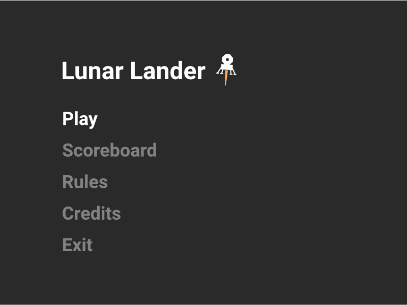
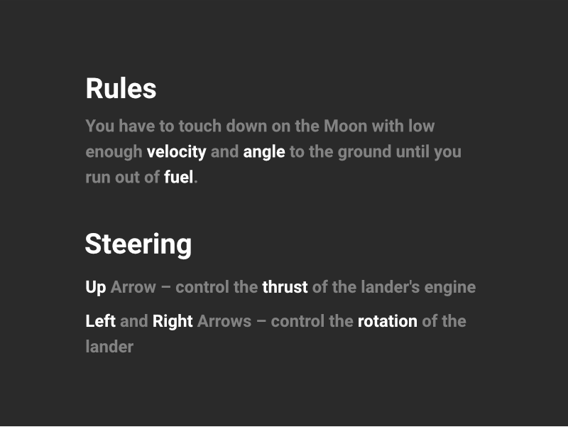

# Lunar Lander, first stage

A simple 2D game written in Java 11 and JavaFX 11 in which you
have to touch down on the Moon with low enough velocity and
angle to the ground until you run out of fuel.

## Goal

Your goal is to find a suitable space on the moon surface for lander.
Take the right course and reduce velocity enough to prevent breaking your
vehicle. Remember that your fuel and number of vehicles are limited.

## Steering

- Left and Right Arrows - control the rotation of the lander
- Up Arrow - control the thrust of the lander's engine

## Win and loss condition

Providing a soft landing for your lander is your only mission. Avoid hitting
rocks and trying to reach the ground to gustily - otherwise you will lose one
of your 3 vehicles. You have to watch your fuel levels, which are shared
between the fleet. When fuel meter indicates 0, you won't be able to change
the course and lander's velocity, which will likely result in crash.
Sometimes there will appear fuel tanks on the map. Landing on them will reward 
you with additional resources for next stages.

## Levels and score

Each successful landing scores you 100 points plus bonus, depending on how
fast you manage to land. Extra reward starts from 60 points and decreases by 1
each second. 

You don't choose difficulty level - it will increase itself with next levels.
It means that gravity constant, acceptable threshold of landing and moon
terrain will change in order to make your task harder. 

## User interface

App starts with main menu window **(picture 1)**. Here you can choose:

- Play
  * Moves to view **(picture 2)** with gameboard and starts a game. On the
    right side you can check current level, score and parameters of lander.
    Pressing ESC pauses the game **(picture 3)**. After losing or pressing
    the *Go back to the main menu* button with your mouse you end the
    current session with a pop-up dialog in which you can input your name to
    have your score saved in a scoreboard. Scoreboard holds up to 20 nicknames
    of the best players. It will be stored in a text file for now. Server address 
    and port will be stored in a json file under "server_address" and "server_port" keys.
    If a port is not specified, the default will be used.
- Rules
  * Moves to view of all the rules listed **(picture 4)** above.
- Scoreboard
  * Moves to the scoreboard **(picture 5)**
- Credits
  * Moves to credits board **(picture 6)** that includes names of app's
    creators and **(if it turns out to be managable) musical cover supposed
    to be a theme of the game** - we hope that it can be allowed as an
    *additional element* rated at 7 points.
- Exit
  * Closes the app.

