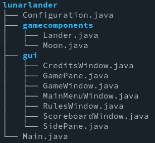
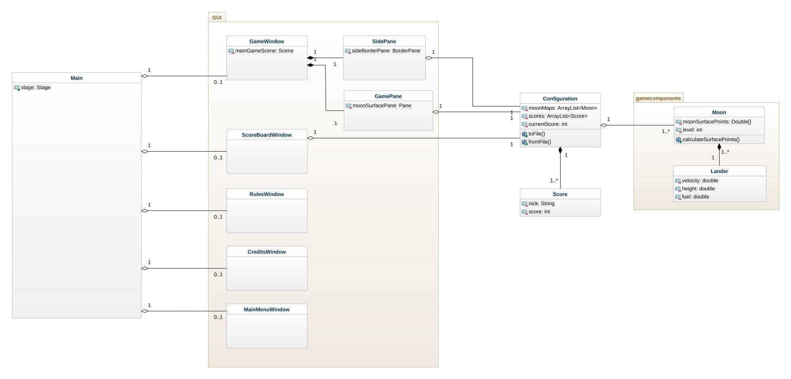

# Lunar Lander, second stage

## File structure

## UML Class diagram

The class diagram presented below is a probable structure of our project
implemented in the next stages.

## GUI prototype
In this stage we implemented a prototype of an interface. This includes Game Pane with
outlined surface of the moon and Side Pane - bar demonstrating current state of game 
and our lander statistics.

## Configuration files

We created a class converting Moon class surfacePoints array into a JSON file (and vice versa).
In the project the configuration.json file is already included.

Points are generated by method calculateSurfacePoints() in Moon.java class. For now we will stick to that generator,
but it can still be changed by the end of the development of the game. 

